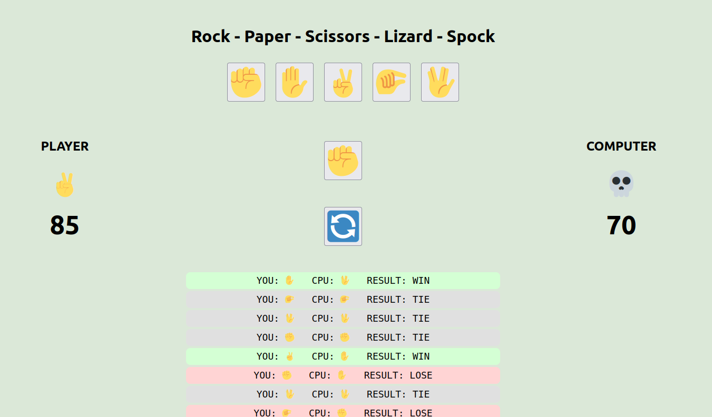

# Rock-Paper-Scissors-Lizard-Spock (RPSLS)

A full-stack implementation of the classic **Rock - Paper - Scissors - Lizard - Spock** game, built with a Python FastAPI backend and a React frontend. The game includes features like animations, scoring, game history, random move generation, Redis-based buffering, Celery for background tasks, and persistent local storage.

---

## Technologies Used

### Backend
- Python 3.12
- FastAPI
- Redis (buffer/cache)
- Celery (background tasks)
- Docker & Docker Compose
- Flake8 (code linting)

### Frontend
- React (Create React App)
- CSS Animations
- LocalStorage for persisting scores and game history
- Tooltips (hover hints for emoji buttons)

---

## Running the Project

### 1. Clone the repository

```
git clone git@github.com:NinoBaus/rpssl.git
cd rpssl
```

### 2. Run services

```docker compose -f docker-compose.yaml up --build```

This will spin up the following services:

    app – FastAPI backend (http://localhost:8000)

    react_app – React frontend (http://localhost:3001)

    worker – Celery worker that fills Redis with random numbers

    beat – Celery beat for scheduling tasks

    redis – Redis database

    redis-commander – Redis UI (http://localhost:9001)

    lint – runs flake8 checks on your backend code

## Service	URL
```
Frontend	http://localhost:3001
Backend API	http://localhost:8000
Backend API docs http://localhost:8000/docs
Redis Commander	http://localhost:9001
```
## Developer notes

Since we are limited by provided endpoint https://codechallenge.boohma.com/random for randomizing computer choice, 
straight forward solution for calling endpoint every time when user plays isn't an option, and it's a limiting factor that
is stopping our service from being scalable. Because of that, I implemented few things that should make our game playable.
1. Buffer : There is a celery task that is calling the endpoint every three seconds and saving random number to Redis
2. In this version Redis will keep 500 results so that we would stop calling endpoint after the buffer memory is full.
3. When the player pick the sign, frontend will show winning / losing / tie animations for one second. Within that one second, player will not be albe to make another choice, which is giving us more time to fill the buffer.

If the buffer is empty, or if Redis isn't available, only then we will call the endpoint directly from our backend 
microservice.
If API call fails for whatever reason, I will show skull icon 💀 for CPU player as a sign that it's currently not working.

Since the task didn't require database for storing values, all logic for showing previous results is happening on UI. 
I used browser local storage to save data, so that player could continue playing the game when he re-joins it.
To make everything much more simple, I used emojis as a way to show the signs.

- rock: ✊
- paper: ✋
- scissors: ✌️
- lizard: 🤏
- spock: 🖖
- dead: 💀 - Used when random number service is unreachable
- greeting: 🖐 - Used as placeholder for player and cpu when nothing was played
- question mark: ❓ - Click on it to get random sign as a suggestion
- restart: 🔄 - Used to restart the game and it's scores


